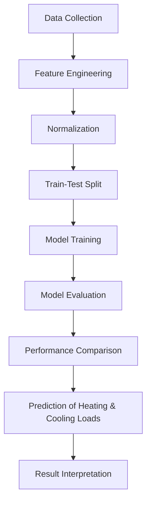

# 🏠 Building Energy Efficiency Prediction using Machine Learning

---

### 🌿 *"Optimizing Energy for a Sustainable Future"*

This project leverages **machine learning techniques** to predict the **heating load (HL)** and **cooling load (CL)** of buildings using architectural and environmental data.
By accurately forecasting these loads, architects and engineers can design **energy-efficient buildings**, reduce **HVAC costs**, and promote **sustainability**.

---

## 💡 Overview

Energy consumption in buildings accounts for **nearly 40% of total global energy use**.
Reducing this consumption is essential for sustainable growth, cost reduction, and environmental conservation.

This project focuses on **predicting the energy loads of buildings** — particularly **Heating Load (HL)** and **Cooling Load (CL)** — during the design phase.
These predictions help engineers and architects make **data-driven design decisions** to improve **building performance** and **energy efficiency**.

---

## ❓ Problem Statement

The goal of this project is to develop a **predictive model** capable of estimating the **heating and cooling requirements** of a building based on its physical characteristics and orientation.

This helps in:

* Reducing excessive energy usage
* Optimizing HVAC system design
* Lowering operational costs
* Enabling sustainable architectural practices

---

## 📊 Dataset Description

The dataset contains building parameters such as shape, size, materials, and glazing, which directly influence energy requirements.

| **Feature Type**            | **Description**                                                                                                                |
| --------------------------- | ------------------------------------------------------------------------------------------------------------------------------ |
| **Input Variables**         | Relative Compactness, Surface Area, Wall Area, Roof Area, Overall Height, Orientation, Glazing Area, Glazing Area Distribution |
| **Output Variables**        | Heating Load (HL), Cooling Load (CL)                                                                                           |
| **Data Split**              | 67% Training — 33% Testing                                                                                                     |
| **Normalization Technique** | Standard Scaler                                                                                                                |

**Dataset Goal:** Predict *Heating Load* and *Cooling Load* efficiently from architectural features.

---

## ⚙️ Methodology

The complete workflow can be summarized in these stages:

### 🧹 1. Data Preprocessing

* Handled missing and inconsistent data
* Normalized features using **StandardScaler**
* Split dataset into training and testing subsets (67:33)

### 🧠 2. Model Building

Implemented multiple regression models:

* Decision Tree Regressor 🌳
* Random Forest Regressor 🌲
* Gradient Boosting Regressor 🚀
* Support Vector Regressor (SVR) 📈

### 🧾 3. Model Evaluation

Models were evaluated using:

* **Root Mean Squared Error (RMSE)**
* **R² Score**
* **Cross-Validation (k-Fold, Shuffle Split)**

### 📈 4. Model Selection

The **Gradient Boosting Regressor** was chosen as the best-performing model with:

* High accuracy
* Low RMSE
* Excellent generalization to unseen data

---

## 🤖 Models Implemented

| **Model**                   | **Train Accuracy (R²)** | **Test Accuracy (R²)** | **Remarks**                           |
| --------------------------- | ----------------------- | ---------------------- | ------------------------------------- |
| Decision Tree Regressor     | 1.000                   | 0.997                  | Overfitted the training data          |
| Random Forest Regressor     | 0.999                   | 0.998                  | Excellent generalization              |
| Gradient Boosting Regressor | 0.999                   | 0.999                  | Best overall performance              |
| Support Vector Regressor    | 0.998                   | 0.996                  | Consistent but slightly less accurate |

> ✅ **Gradient Boosting Regressor** provided the best balance between accuracy, interpretability, and robustness.

---

## 📈 Results & Discussion

* **Gradient Boosting** achieved near-perfect accuracy for both heating and cooling loads.
* **Random Forest** displayed great generalization and stability.
* **Decision Tree** showed overfitting, requiring pruning or tuning.
* **SVR** was robust but computationally expensive.

**Key Insights:**

* Energy prediction accuracy >99%
* Building geometry & glazing area were top influencing factors
* Ensemble methods (RF, GB) outperform single estimators

---

## 💻 Technologies Used

| Category            | Tools / Libraries                                          |
| ------------------- | ---------------------------------------------------------- |
| **Language**        | Python 🐍                                                  |
| **Libraries**       | `NumPy`, `Pandas`, `Matplotlib`, `Seaborn`, `Scikit-learn` |
| **Environment**     | Jupyter Notebook / Google Colab                            |
| **Version Control** | Git & GitHub                                               |
| **Documentation**   | Markdown, LaTeX                                            |

---

## 🧭 Flow Diagram



---

## 🚀 Future Enhancements

* 🔹 Integrate **Deep Learning models** (e.g., ANN, CNN) for feature learning
* 🔹 Include **real-world energy datasets** with climate & occupancy data
* 🔹 Develop a **web dashboard** for live energy efficiency prediction
* 🔹 Extend to **carbon footprint estimation** for green certification support

---

**Under the Guidance of:**
🎓 *Prof. Priti Chakurkar*
*School of Computer Engineering and Technology,
MIT World Peace University, Pune, India*

---

## 📚 References

1. Seyedzadeh, S. *et al.* (2018). *Machine learning for estimation of building energy consumption and performance.* Visualization in Engineering, 6(1), 1–20.
   [DOI:10.1186/s40327-018-0064-7](https://doi.org/10.1186/s40327-018-0064-7)

2. Tien, P. W. *et al.* (2022). *Machine Learning and Deep Learning Methods for Enhancing Building Energy Efficiency and Indoor Environmental Quality.*
   [Energy and AI, 10, 100198](https://doi.org/10.1016/j.egyai.2022.100198)

3. Izonin, I. *et al.* (2023). *Machine learning for predicting energy efficiency of buildings: A small data approach.*
   [Procedia Computer Science, 231, 72–77](https://doi.org/10.1016/j.procs.2023.12.173)

---

## 🗂 Repository Structure

```
Building-Energy-Efficiency/
│
├── data/                     # Dataset files
├── notebooks/                # Jupyter notebooks for training & testing
├── models/                   # Trained ML models
├── reports/                  # Project report and visuals
├── README.md                 # Project documentation
└── requirements.txt           # Python dependencies
```

---

## 🌟 Key Takeaways

* Data-driven ML models can **drastically improve energy-efficient building design**
* Ensemble regressors (like Gradient Boosting) offer **high accuracy and generalization**
* The project supports the **global push toward sustainable architecture** and smart energy use

---

### ⭐ If you found this project interesting, please give it a **star** on GitHub!

Together, let’s make our buildings — and our planet — more energy-efficient 🌏💚

---

